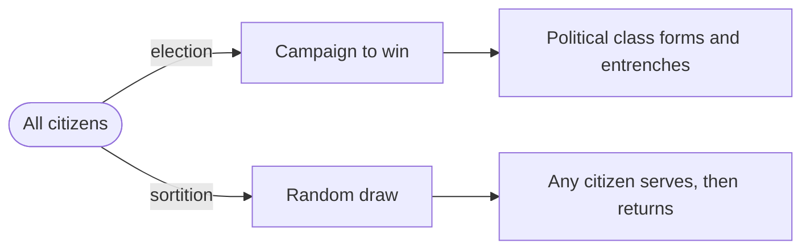
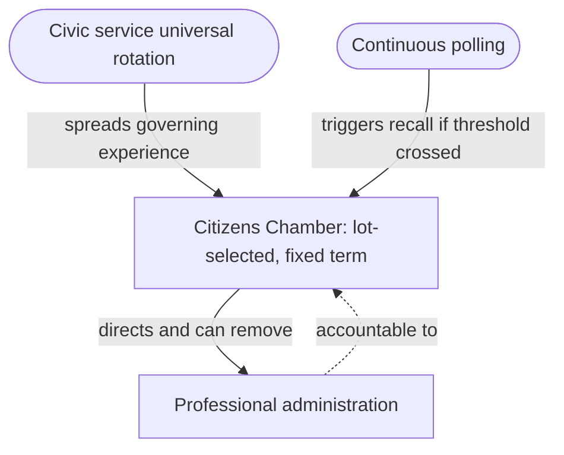
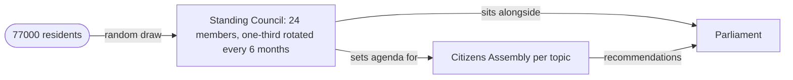

Something is wrong with the machine, and tinkering with the operators hasn't fixed it. Across the OECD, the most recent cross-national trust survey found that more people now hold low or no trust in their national government than hold high or moderately high trust: roughly 44 percent against 39. In the United Kingdom, fewer than three in ten say they trust the national government at all. The picture is healthier in Switzerland and the Nordics, but across most of the continent the direction of travel is the same, and it has little to do with any single scandal.

The instinctive fix is to change the cast. Throw out this party, elect that one, find cleaner candidates. We have been running that experiment for the better part of a century, and dissatisfaction has climbed regardless. At some point the honest question is whether the people we elect are the variable at all. Perhaps the trouble is the election.

It sounds like a radical thing to say. It is also one of the oldest ideas in Western politics, older than the word *democracy* itself.

## What Athens actually meant

We tend to remember Athenian democracy as a forest of raised hands in the agora. What drops out of the picture is that for most public offices the Athenians did not vote. They drew lots. A device called the *kleroterion* selected officials at random from the body of eligible citizens, who served a term and then made way for someone else. Elections existed, but they were confined to a few specialist roles, the generals above all, and were treated with a certain wariness.

Aristotle stated the principle without ornament in the *Politics*: to assign offices by lot is considered democratic, to elect them oligarchic. This was not a paradox he was reaching for. The reasoning is structural. Elections reward the people who are good at winning elections, and over enough time that filter produces a settled class whose vocation is the acquisition and retention of power. A lottery has no such filter. There is no result to purchase when no one is conducting the draw, and no machine to build around an office that cannot be captured in advance.

The same intuition turns up wherever people have thought hard about what freedom requires. Montesquieu held that selection by lot belongs to the nature of democracy and selection by vote to aristocracy. The merchant republics of Renaissance Italy built elaborate lottery mechanisms for one purpose above all, which was to stop a few powerful families from closing their grip on the state.

So the thing we now treat as the very definition of democracy, the contested election, is the element the ancients filed under oligarchy. We inherited their architecture and renamed it. What we call democracy, Aristotle would have recognised as a refined and well-mannered oligarchy: rule by a small group, drawn in principle from anywhere, who earn their seats by persuading crowds.

## The case for the lottery

Set the history aside and sortition, the technical term for selection by lot, answers a specific and stubborn set of problems.

The first is the career itself. There is no campaign to run, no donor to keep happy, and, more to the point, no re-election to position for. Someone chosen by lot serves out the term and goes back to ordinary life, which strips away most of the incentive to govern for the next news cycle rather than the next decade.

Money loses its handle for much the same reason. The most expensive instrument in modern politics is the ability to fund and flatter the people who will hold office, and that instrument does nothing against a representative who does not exist until a draw produces them.

A chamber filled this way also looks far more like the country it governs. Elected legislatures run heavily to lawyers and graduates and the comfortably ambitious; a body drawn by lot, balanced a little for age and region, ends up holding the carer and the welder and the man who has been out of work for two years, in roughly the proportions they exist outside. The point is not mainly cosmetic. Rooms full of similar people tend to share the same blind spots and to be confidently wrong about the same things at the same time, which is more or less what happened to elite opinion in the long calm before 2008.

The same OECD survey points at something sitting underneath all of this. When researchers looked for what best predicts trust in government, the answer was not income or growth, and not even satisfaction with public services. It was whether people felt they had a say. Among those who felt heard, 69 percent trusted their national government; among those who felt they had none, only 22 did. Sortition is one of the few proposals on the table that speaks to that gap, and it does so by making it a live possibility that the next person deciding a question is you.

## Why pure lottocracy fails

None of which means we should abolish elections next month. The candid answer is that rule by lot, on its own, cannot run a modern state, and refusing to admit that is how the idea gets itself dismissed.

A country with a central bank and a standing defence policy cannot suspend business to convene a citizens' panel every time something is due by Friday. It needs people who carry the institutional memory and can act quickly when something breaks. Athens had perhaps sixty thousand citizens and could gather the relevant ones in a single square; we have states of tens of millions and questions that need someone who actually understands monetary policy. The objection most advocates prefer to wave away is the one that sinks the pure version, which is scale.

The second objection is sharper. Elections do two jobs, and we mostly notice the first. They choose governments, and they also remove them. Blunt as it is, the ballot lets a public dismiss a government that has failed, and the lottery offers nothing like it. You cannot vote out a random citizen. That single fact, more than any high theory, is what makes ordinary people back away from the idea, and a system that fixes representation while quietly deleting accountability has not obviously improved anything.

One more concession is worth making, because sortition's supporters tend to oversell it. The claim that diverse amateurs reliably out-reason experts holds only under particular conditions; on a technical question a random group is not secretly wiser than the specialists. The honest version is smaller. Mixed bodies resist groupthink better, and they carry a legitimacy no panel of experts can manufacture. That is worth a great deal, and it is still not a reason to dispense with expertise.

## The shape of a workable hybrid

Take those objections seriously and you do not arrive at lottocracy. You arrive at something layered, with the lottery at the centre and the rest built to hold it up.

Picture a legislature, or at least its more powerful chamber, filled by lot rather than election: citizens drawn at random, balanced enough to mirror the population, serving a fixed term before going back to ordinary life. Their job is to set the direction of policy and to keep the executive on a short rein.

Beneath them would sit a professional administration to handle implementation and crisis response. Call it a technocracy, if the word doesn't frighten you; it is only sinister when the technocrats answer to no one. Here they would serve at the pleasure of the chamber, which could overrule them or remove them whenever it chose. Expertise on tap, not on the throne.

Around the whole arrangement sits a safety valve of direct democracy. Referendums on every passing question would only hand victory to whoever commands the most attention, so the steadier version is independent, continuous polling that works like an early-warning system. When dissatisfaction with a decision or an official crosses a defined line, it triggers a formal recall. In a connected society there is no reason that vote must fall on a single day; it can run over weeks. The public keeps a hand on the brake without having to steer at every moment.

One last element makes the rest cohere, and it borrows a recognisably Nordic habit. A country that already asks its young people for a year of military or civil service could ask instead for a stretch of civic service, meaning time spent inside the machinery of governance, locally first and then nationally. Done at scale, this answers the deepest worry about any participatory model, which is that only the already-engaged and the already-online ever show up, so that the loudest minority becomes the new elite. Universal rotation does the reverse. It spreads the experience of governing across the whole population and keeps the chamber turning over fast enough that no faction can set hard. Athens freed its citizens for politics on the backs of slaves; we have automation and broadband instead, which is at least a less monstrous version of the same bargain.

## It already exists, in miniature

None of this is purely theoretical. Europe has been running the experiments for years, on a small scale and with little fanfare.

Since 2019 the German-speaking community of Belgium, a region called Ostbelgien with roughly 77,000 inhabitants, has operated the world's first permanent citizens' body wired directly into a law-making parliament. A standing council of twenty-four residents, chosen by lot and rotated so that a third are replaced every six months, sets the agenda and convenes larger assemblies on the topics it picks. Members are paid for their time, and teenagers and resident non-citizens can be drawn alongside everyone else. It is not decoration bolted to the side of the old system. It sits as a third institution next to the parliament and the executive.

Ireland has gone further in a different direction. Randomly selected citizens there deliberated for months over questions the political class found too dangerous to touch, and their recommendations fed straight into the referendums that legalised same-sex marriage and abortion. France convened a climate convention by lot. Most of these bodies remain advisory, and that boundary is the one to watch, because an assembly that advises and an assembly that governs are separated by the entire distance between a pressure valve and a constitution.

## The catch nobody can engineer away

Suppose all of this holds up: old, coherent, already working on a small scale. One obstacle remains that no clever design can remove. The only people with the standing to propose the change are the people it would put out of work. A sitting politician arguing to abolish elections is arguing for their own redundancy, and political systems do not tend to produce that from the inside.

So if sortition ever grows beyond a German-speaking corner of Belgium, it will not arrive through an act of parliament. It will come the way deep change usually comes, from the outside, through stubborn argument and through small local pilots that work better than what sits next to them, until the case becomes awkward to ignore. Begin in one municipality. Run it for a decade. Show that ordinary people, handed real responsibility and real support, decide about as well as the professionals do, with more legitimacy and less capture. Let the evidence pile up, and wait for one of those moments when a society stops and asks whether the system it inherited is the one it would actually choose, when some crisis or some slow institutional death finally forces the question.

Whether that moment comes in any of our lifetimes is anyone's guess, and the comfortable democracies are not the obvious ones to move first. But the idea will still be there when it does. It has been there a long time already.
